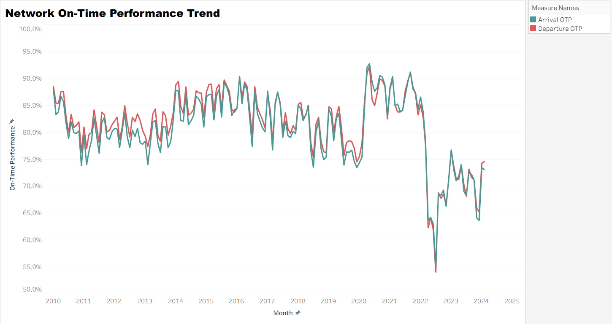
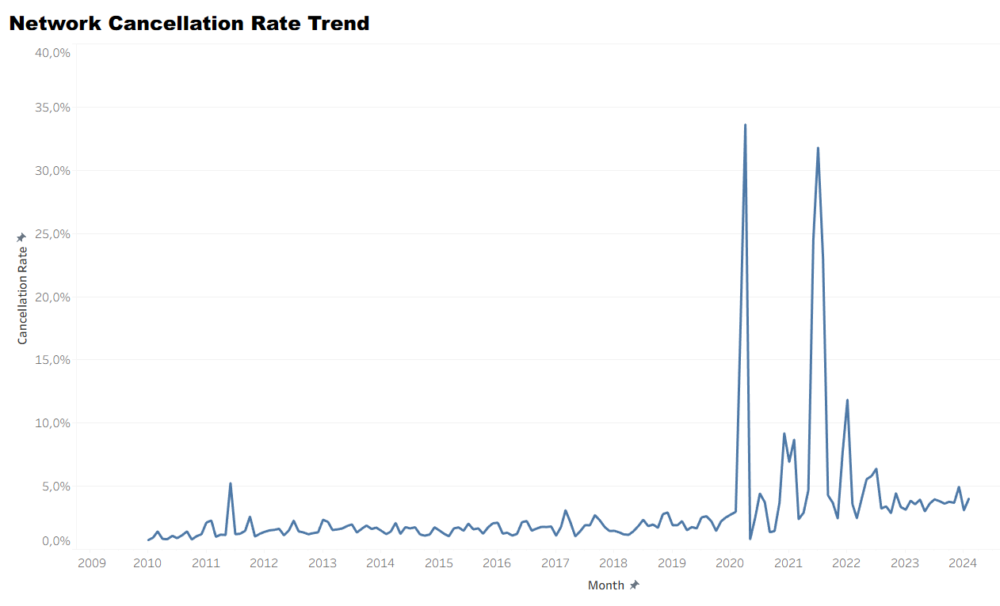
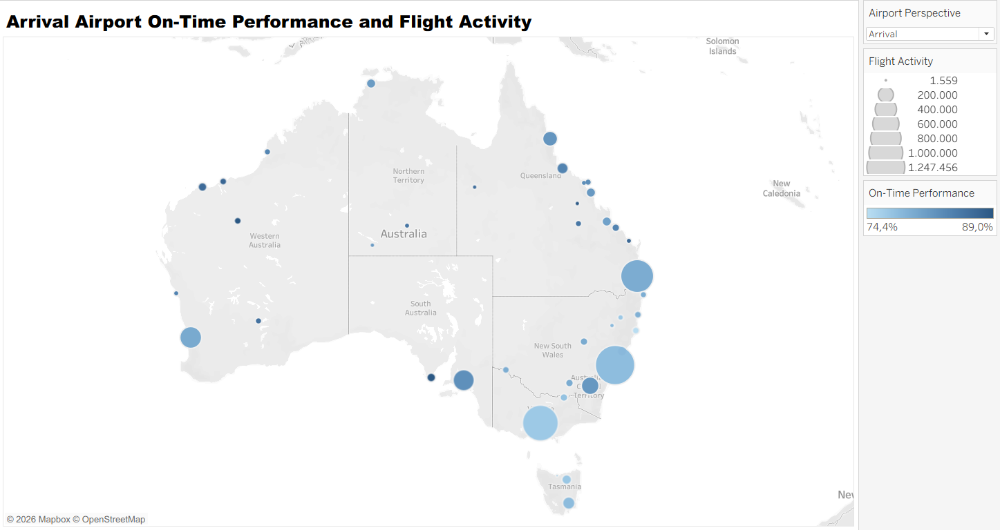
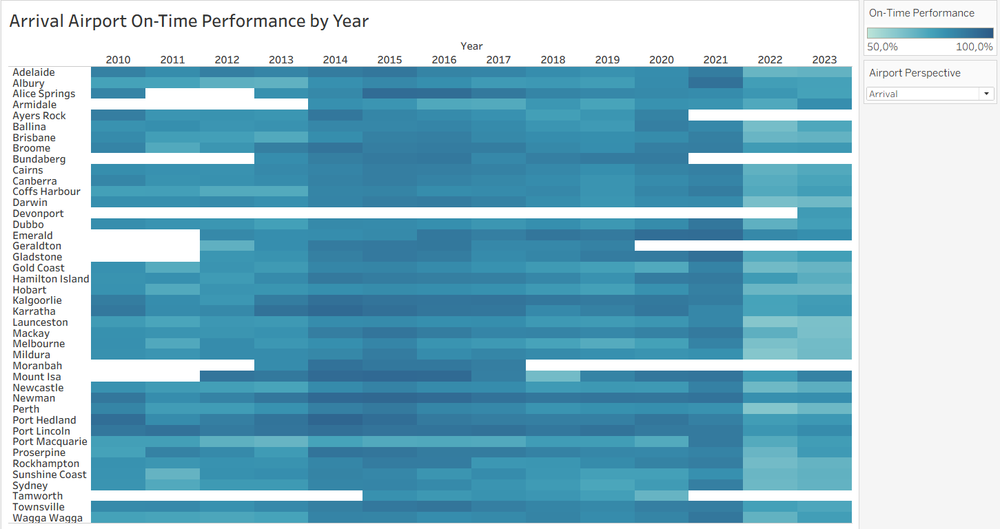
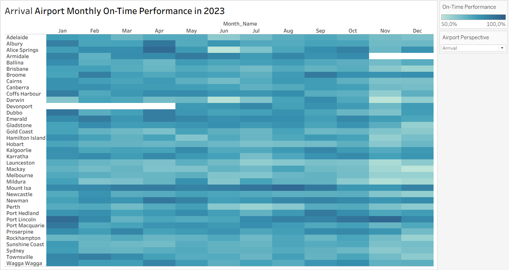
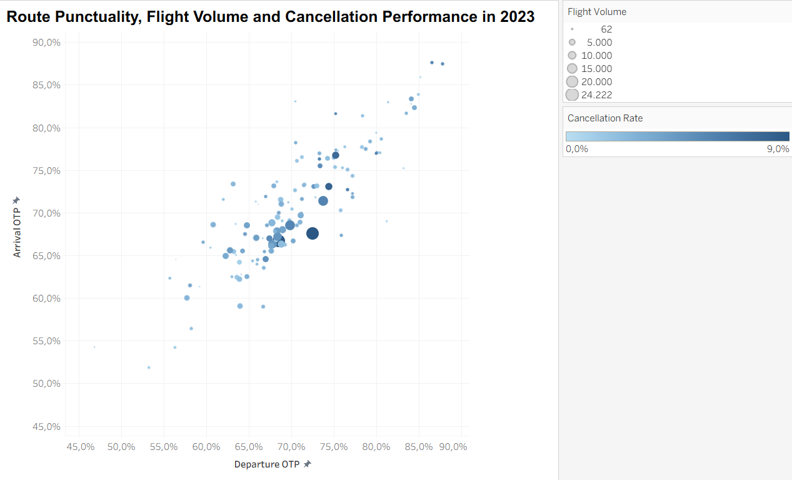
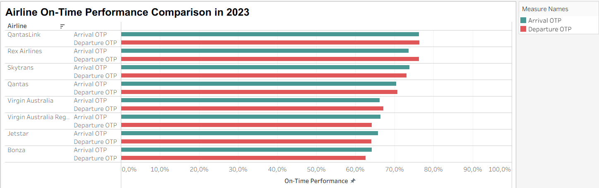

# Australian Airline Punctuality & Reliability Visual Analytics

**Tools:** R, R Markdown, Tableau  
**Coverage:** January 2010 - February 2024  
**Focus:** on-time performance, cancellations, airport/route/airline comparison, weighted KPI design, visual analytics



## Business Question

How do Australian domestic airlines, airports, and routes differ in punctuality, cancellation reliability, and operational scale, and what patterns become visible when those dimensions are analysed together?

The project combines a reproducible R workflow with Tableau visual analytics. R handles auditing, integration, cleaning, feature engineering, weighted KPI calculation, and validation. Tableau provides geographic, temporal, route, airport, and airline exploration.

## Dataset and Analytical Layer

The project analyses Australian domestic airline on-time performance data associated with the Bureau of Infrastructure and Transport Research Economics (BITRE) monthly reporting program.

The cleaned analytical layer contains:

- **80,972** observations
- **170** monthly periods
- **42** physical airports
- **155** route labels
- **12** standardised airline labels
- coverage from **January 2010 to February 2024**

The workflow explicitly checks duplicate records, missing values, naming consistency, date coverage, and the relationship between calculated and published percentages.

See [`DATA_NOTE.md`](DATA_NOTE.md) for provenance and scope.

## Headline Findings

### Network performance

Across the full analysis period:

- weighted Departure OTP: **81.0%**
- weighted Arrival OTP: **79.9%**
- overall Cancellation Rate: **2.62%**

Large cancellation spikes were observed in **April 2020 (33.6%)** and **July 2021 (31.8%)**.

The weakest monthly network punctuality in the analysis occurred in **July 2022**:

- Departure OTP: **54.0%**
- Arrival OTP: **55.0%**

### Airport concentration

Sydney, Melbourne, and Brisbane together accounted for approximately **56.6% of departure flight activity**.

### Airport recovery

- From 2021 to 2022, all **36 comparable airports** recorded lower Arrival OTP.
- From 2022 to 2023, **29 of 36** comparable airports improved.

### Route example

For 2023, **Melbourne-Sydney** was the highest-volume route:

- sectors flown: **24,222**
- Departure OTP: **72.5%**
- Arrival OTP: **67.6%**
- cancellation rate: **8.95%**

These results illustrate why punctuality should be interpreted together with cancellation reliability and traffic volume rather than as a single ranking metric.

## Tableau Views

The workbook contains seven analytical worksheets.

### 1. Network OTP Trend


Monthly weighted departure and arrival punctuality from 2010 to early 2024.

### 2. Network Cancellation Trend



Cancellation reliability is separated from OTP because its scale and disruption spikes are materially different.

### 3. Geographic Airport Performance



Airport activity and punctuality are combined with geographic context.

### 4. Airport-Year Heatmap



A compact view for comparing airport performance across complete years.

### 5. Airport-Month Heatmap



Monthly variation across airports for the latest complete year used in the visual analysis.

### 6. Route Performance Scatterplot



Route-level departure OTP, arrival OTP, volume, and cancellation reliability are examined together.

### 7. Airline Performance Comparison



Airline-level punctuality and reliability comparison with operational scale retained for context.

## Analytical Workflow

The R pipeline is intentionally split into four stages:

```text
01_data_audit
    ↓
02_data_cleaning
    ↓
03_feature_engineering
    ↓
04_analysis_findings
```

### 01 - Data Audit

Checks workbook structure, worksheets, schema, record counts, duplicate coverage, and basic data quality.

### 02 - Data Cleaning

Integrates the relevant worksheets, removes non-data records, standardises field names and airline labels, converts data types, and produces the clean dataset.

### 03 - Feature Engineering

Creates analysis levels and reusable temporal and operational fields, then validates calculated percentages against source values.

### 04 - Analysis Findings

Calculates weighted network, airport, route, and airline metrics and reproduces the main quantitative findings used in the report.

## Weighted KPI Design

On-time performance is calculated from underlying flight counts rather than by averaging pre-calculated percentages.

Conceptually:

```text
Departure OTP = Total Departures On Time / Total Sectors Flown

Arrival OTP   = Total Arrivals On Time / Total Sectors Flown

Cancellation Rate = Total Cancellations / Total Sectors Scheduled
```

This prevents small and high-volume routes or airports from receiving equal weight when network-level performance is summarised.

## Tableau Reproducibility

Workbook:

```text
tableau/airline_visual_analytics.twb
```

The workbook uses a **relative datasource path**:

```text
../data/processed/airline_performance_analysis.csv
```

This allows the workbook to be opened from the repository structure without relying on the original author's local machine path.

## How to Reproduce

Required R packages include:

```r
install.packages(c("readxl", "dplyr"))
```

Run the R Markdown files in order:

```text
scripts/01_data_audit/data_audit.Rmd
scripts/02_data_cleaning/data_cleaning.Rmd
scripts/03_feature_engineering/feature_engineering.Rmd
scripts/04_analysis_findings/analysis_findings.Rmd
```

Then open:

```text
tableau/airline_visual_analytics.twb
```

The final Tableau workbook has been tested with the bundled processed dataset and the relative datasource path. The original coursework-packaged raw workbook is intentionally not redistributed; [`data/raw/README.md`](data/raw/README.md) records the public BITRE source and the expected local filename for an authorised rerun.

## Detailed Report

The full analytical discussion, visual-design rationale, limitations, scalability discussion, and references are available in:

[`report/analysis_and_insights.pdf`](report/analysis_and_insights.pdf)

## Project Structure

```text
airline_performance_visual_analytics/
├── data/
│   ├── raw/
│   │   └── README.md                    # source and authorised-input instructions
│   └── processed/
│       ├── airline_performance_clean.csv
│       └── airline_performance_analysis.csv
├── figures/
│   ├── Airline_Performance_Comparison.png
│   ├── Airport_Month_Heatmap.png
│   ├── Airport_Year_Heatmap.png
│   ├── Geographic_Airport_Performance.png
│   ├── Network_Cancellation_Trend.png
│   ├── Network_OTP_Trend.png
│   └── Route_Performance_Scatterplot.png
├── report/
│   └── analysis_and_insights.pdf
├── scripts/
│   ├── 01_data_audit/
│   ├── 02_data_cleaning/
│   ├── 03_feature_engineering/
│   └── 04_analysis_findings/
├── tableau/
│   └── airline_visual_analytics.twb
├── DATA_NOTE.md
└── README.md
```

## Limitations

- The data describe operational outcomes but do not identify the causal reasons for delays or cancellations.
- Weather, congestion, staffing, aircraft availability, delay duration, and disruption-cause variables are not included.
- February 2024 is the end of the available analysis period, so 2024 is only a partial year.
- One-year monthly comparisons should not be interpreted as proof of recurring seasonality.
- Weighted KPIs depend on traffic composition; flight volume should remain visible alongside percentage-based performance measures.
- Observed relationships are descriptive and should not be interpreted as causal effects.
