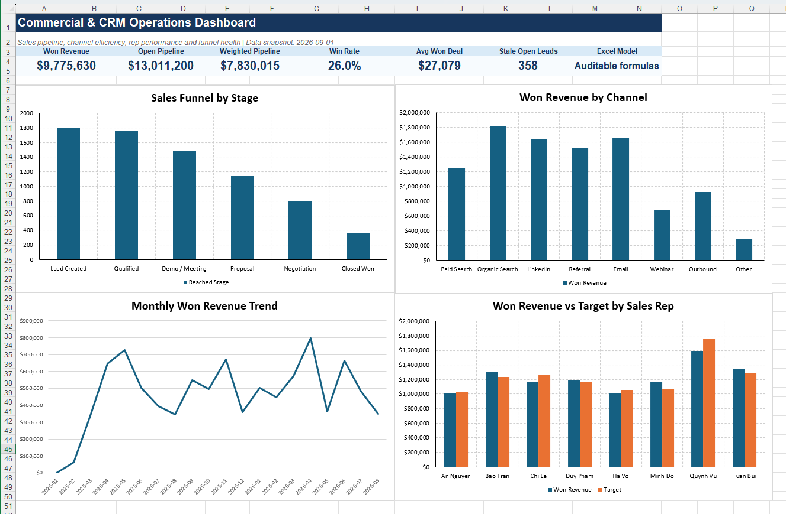

# Commercial & CRM Operations Analysis | Excel

**Project type:** Commercial / CRM analytics case study  
**Tools:** Microsoft Excel  
**Dataset:** 1,800 synthetic CRM leads  
**Period:** January 2025 to August 2026

This project turns a CRM-style sales pipeline into a management view of funnel leakage, acquisition-channel quality, sales-rep performance, open-pipeline health, and stale opportunities.



---

## Business Question

Which parts of the CRM funnel, acquisition mix, sales team, and open pipeline deserve management attention first?

The workbook is designed so that headline KPIs and management findings can be traced back to row-level CRM records and formula-driven analysis sheets.

---

## Headline KPIs

| KPI | Result |
|---|---:|
| Won Revenue | $9,775,630 |
| Open Pipeline | $13,011,200 |
| Weighted Pipeline | $7,830,015 |
| Win Rate | 26.0% |
| Average Won Deal | $27,079 |
| Stale Open Leads | 358 |

These values were rechecked in the final Excel runtime test.

---

## Management Findings

### 1. Late-stage conversion is the largest funnel leak

**361 of 792** opportunities that reached Negotiation progressed to Closed Won.

That represents a **45.6% conversion rate** from Negotiation to Closed Won, or a **54.4% drop-off** at the final stage.

The practical management question is therefore not only how to generate more leads, but whether negotiation objections, pricing approval, proposal quality, and follow-up discipline are limiting conversion.

### 2. Paid Search brings scale but weaker commercial efficiency

Paid Search generated **346 leads**, the highest channel volume in the dataset, but its observed win rate was only **20.9%**.

This makes targeting quality, qualification criteria, keyword intent, and landing-page alignment reasonable areas for investigation.

### 3. Email shows the strongest observed channel efficiency

Email achieved a **32.0% win rate** and approximately **$7,705 revenue per lead**, the strongest combination in the workbook.

This is an observed association in the synthetic portfolio dataset rather than evidence that all acquisition budget should be shifted to Email.

### 4. Pipeline quality requires active ageing control

The workbook flags **358 open leads older than 30 days**.

These records can overstate effective pipeline coverage unless they are requalified, progressed, or closed.

### 5. Rep performance should be read across several measures

Quynh Vu generated the highest won revenue at approximately **$1.59M**, while Minh Do recorded the highest target attainment at **108.7%**.

The workbook therefore evaluates reps using multiple dimensions rather than ranking them on revenue alone.

---

## Workbook Structure

| Sheet | Purpose |
|---|---|
| `Dashboard` | Executive KPI dashboard and four management charts |
| `CRM_Data` | 1,800 CRM records plus calculated analytical fields |
| `Rep_Performance` | Rep-level leads, wins, revenue, pipeline, cycle time and target attainment |
| `Channel_Performance` | Acquisition-channel volume and commercial efficiency |
| `Funnel_Analysis` | Stage reach, conversion and drop-off |
| `Monthly_Trend` | Monthly leads, wins, won revenue, average won deal and win rate |
| `Action_List` | Prioritised management findings and recommended actions |
| `Lookups` | Source mappings, product mappings, rep attributes, targets and control values |
| `Data_Dictionary` | Field definitions and formula logic |
| `Project_Overview` | Business objective and workbook skill summary |

---

## Formula Logic

The workbook deliberately uses auditable worksheet formulas instead of hard-coded summary values.

### Lookup and standardisation

`VLOOKUP` with `IFERROR` is used to:

- standardise inconsistent raw acquisition-source labels
- map product codes to product names and categories
- map sales reps to region and team
- retrieve rep revenue targets

Using `VLOOKUP` keeps the workbook compatible with Excel installations where `XLOOKUP` is unavailable.

### KPI and aggregation logic

`SUMIFS` and `COUNTIFS` drive:

- won revenue
- open and weighted pipeline
- channel performance
- rep performance
- funnel counts
- monthly trends

### Derived fields

The row-level analytical layer derives:

- clean acquisition channel
- product name and category
- deal segment
- outcome
- actual won revenue
- weighted pipeline
- sales-cycle days
- open-lead age
- SLA / stale flag
- created and closed month
- created quarter
- lead score
- forecast category

Additional Excel techniques include:

- `IF` / nested `IF`
- `IFERROR`
- `TEXT`
- `MONTH`
- `YEAR`
- `ROUNDUP`
- Excel Tables
- Data Validation
- Conditional Formatting
- data bars and colour scales
- chart-driven dashboard design

---

## Dashboard

The final dashboard contains four validated charts:

1. **Sales Funnel by Stage**
2. **Won Revenue by Channel**
3. **Monthly Won Revenue Trend**
4. **Won Revenue vs Target by Sales Rep**

The workbook was opened and recalculated in Microsoft Excel during final functional testing. Lookup formulas, KPI outputs, and dashboard charts were checked after recalculation.

---

## Reproduce the Project

1. Open `Commercial_CRM_Pipeline_Analytics.xlsx` in Microsoft Excel.
2. If the workbook opens in Protected View, select **Enable Editing** if you trust the downloaded file.
3. Recalculate the workbook if required.
4. Review `CRM_Data` to inspect the row-level inputs and calculated fields.
5. Trace management KPIs through the supporting analysis sheets.
6. Use the `Dashboard` as the executive summary view.

The bundled source dataset is:

```text
data/crm_sales_pipeline_raw.csv
```

The data are synthetic and deterministic for portfolio use. They do not represent real customers, an employer, or confidential business information.

Repository-wide provenance notes are documented in [`../DATA_SOURCES.md`](../DATA_SOURCES.md).

---

## Project Files

```text
commercial_crm_excel_analytics/
├── Commercial_CRM_Pipeline_Analytics.xlsx
├── README.md
├── DATA_NOTE.md
├── data/
│   └── crm_sales_pipeline_raw.csv
├── docs/
└── preview/
    └── dashboard.png
```

Supporting documentation is stored under `docs/`. The public-facing project narrative is intentionally kept in this README so the project can be understood without opening internal supporting notes.

---

## Limitations

- The dataset is synthetic, so findings demonstrate analytical workflow rather than real-market performance.
- Channel and rep results are descriptive rather than causal.
- Weighted pipeline depends on the stage-probability assumptions built into the workbook.
- The stale-opportunity threshold is analyst-defined at 30 days.
