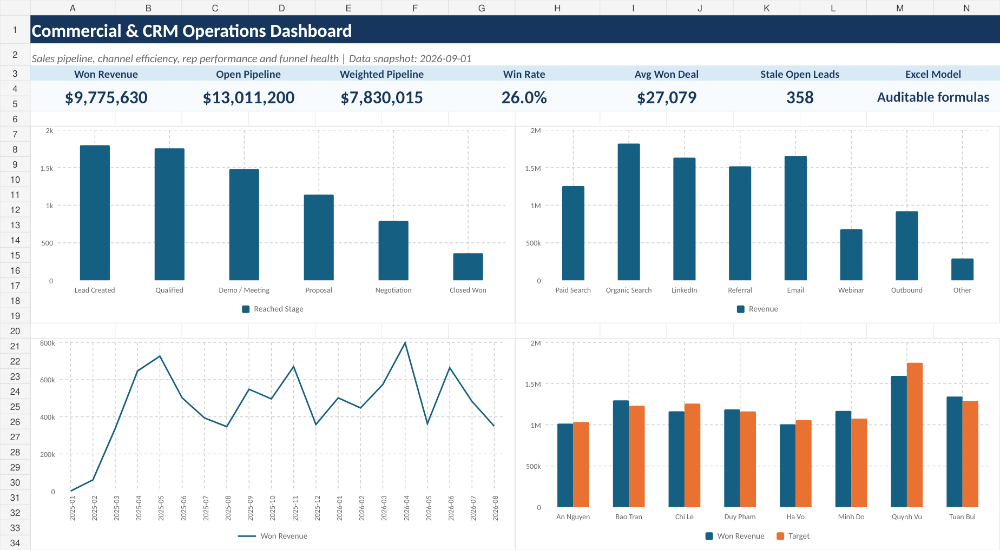

# Commercial & CRM Operations Analysis | Excel

A finished Excel analytics portfolio project focused on **CRM pipeline health, funnel conversion, channel efficiency, rep performance, stale opportunities, and revenue forecasting**.



## Business objective

The workbook answers the management question:

> Which parts of the CRM funnel, acquisition mix, sales team, and open pipeline deserve attention first?

The project uses 1,800 synthetic CRM leads covering January 2025 to August 2026.

## Headline KPIs

| KPI | Result |
|---|---:|
| Won Revenue | $9,775,630 |
| Open Pipeline | $13,011,200 |
| Weighted Pipeline | $7,830,015 |
| Win Rate | 26.0% |
| Average Won Deal | $27,079 |
| Stale Open Leads | 358 |

## Key findings

### 1. The largest funnel leakage is late-stage

Only **45.6%** of opportunities that reached Negotiation closed as Won, implying a **54.4% drop-off** from Negotiation to Closed Won.

The management implication is to examine negotiation objections, pricing approval, follow-up cadence, proposal quality, and loss reasons before simply increasing top-of-funnel volume.

### 2. Paid Search brings the most lead volume but weak commercial efficiency

Paid Search generated **346 leads**, the largest channel volume, but only a **20.9% win rate** and approximately **$3,628 revenue per lead**.

That makes targeting, keyword quality, landing-page alignment, and lead qualification logical investigation areas.

### 3. Email is the strongest observed channel on efficiency

Email achieved a **32.0% win rate** and approximately **$7,705 revenue per lead**, the strongest combination in the workbook.

This should not be interpreted as a reason to shift all acquisition effort into Email: owned/lifecycle channels and paid acquisition have different roles.

### 4. Pipeline quality needs active management

There are **358 open leads older than 30 days**.

The workbook flags these automatically so managers can requalify, progress, or close stale opportunities instead of overstating pipeline coverage.

### 5. Rep performance needs more than one metric

Quynh Vu generated the highest won revenue at approximately **$1.59M**, but reached only **90.9% of target**. Minh Do reached **108.7% of target**.

This demonstrates why rep performance should combine absolute revenue, target attainment, win rate, cycle length, and pipeline coverage.

## Excel skills demonstrated

- XLOOKUP
- SUMIFS
- COUNTIFS
- IF / nested IF
- IFERROR
- TEXT
- MONTH / YEAR / ROUNDUP
- Excel Tables
- Data Validation
- Conditional Formatting
- Data bars and color scales
- Management dashboard design
- Formula-driven KPI analysis
- Channel, rep, funnel, and monthly performance analysis

## Workbook sheets

| Sheet | Purpose |
|---|---|
| Dashboard | Executive KPI dashboard with 4 charts |
| CRM_Data | 1,800-row CRM dataset with raw and calculated fields |
| Rep_Performance | Rep-level revenue, win rate, pipeline, cycle, target attainment |
| Channel_Performance | Channel volume and commercial efficiency |
| Funnel_Analysis | Stage reach, conversion, and drop-off |
| Monthly_Trend | Monthly leads, wins, revenue, deal size, win rate |
| Action_List | Management-ready priorities and recommended actions |
| Lookups | Source mapping, product mapping, rep targets, snapshot date |
| Data_Dictionary | Field definitions |
| Project_Overview | Business objective and Excel skill evidence |

## Data logic

Raw acquisition labels are intentionally inconsistent. `XLOOKUP` plus `IFERROR` standardizes them into clean channels.

Calculated fields then derive:

- clean channel
- product and category
- deal segment
- outcome
- actual won revenue
- weighted pipeline
- sales cycle
- lead age
- SLA / stale status
- created and closed month
- quarter
- rule-based lead score
- forecast category

The analysis sheets use `SUMIFS` and `COUNTIFS` rather than hard-coded aggregates, so the workbook remains auditable.

## Data note

All records are synthetic and deterministic for portfolio use. They are not presented as customer or employer data.

## Files

```text
commercial_crm_excel_analytics_FINAL/
├── Commercial_CRM_Pipeline_Analytics.xlsx
├── README.md
├── data/
│   └── crm_sales_pipeline_raw.csv
├── docs/
│   ├── ANALYSIS_REPORT.md
│   ├── CV_ENTRY.md
│   ├── DATA_DICTIONARY.md
│   ├── EXCEL_SKILLS_EVIDENCE.md
│   ├── FINAL_AUDIT.md
│   └── HR_INTERVIEW_GUIDE.md
└── preview/
    └── dashboard.png
```
