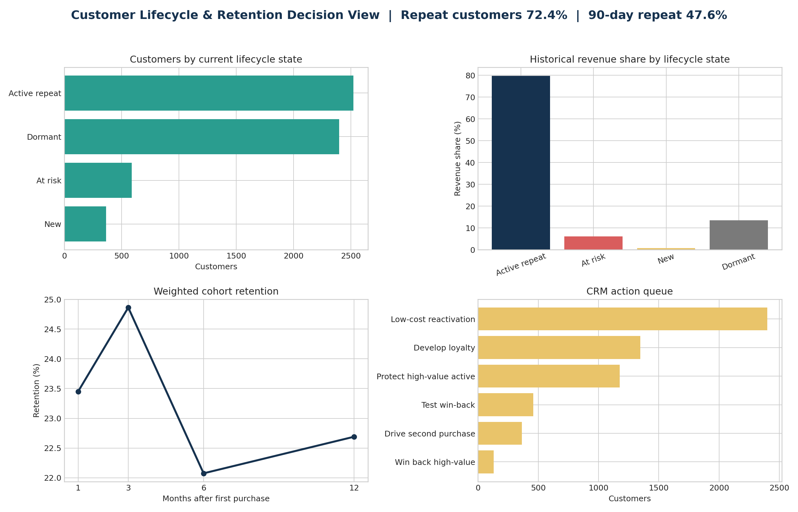

# Customer Lifecycle, Retention & CRM Prioritisation

**Flagship 1 of 3 · Customer & Growth Analytics**  
**Tools:** Python, pandas, matplotlib  
**Data:** 779,425 clean transaction lines · 36,969 orders · 5,878 customers · Dec 2009–Dec 2011

## Business decision

Which customers should the business protect, develop, win back, or deprioritise—and what evidence should CRM use before spending on each group?

The answer cannot come from RFM alone. This project therefore connects four views of customer behaviour:

1. **RFM value segmentation** identifies who has historically mattered.
2. **Repeat-purchase analysis** measures whether acquisition turns into a second order.
3. **Cohort retention** shows whether customers return in later months without mixing mature and immature cohorts.
4. **Lifecycle status** converts recency and purchase history into an actionable CRM queue.



## Decision summary

- **72.4%** of customers placed at least two orders.
- Among customers observed for at least 90 days, **47.6%** made a second purchase within 90 days; repeat customers took a median **55 days** to reach their second order.
- Weighted cohort retention was **23.4% in month 1**, **24.9% in month 3**, **22.1% in month 6**, and **22.7% in month 12**. Only cohorts with a complete observation window enter each headline rate.
- **2,524 active repeat customers** generated **79.7%** of historical revenue, so protecting this group is the first priority.
- **589 at-risk customers** generated **6.1%** of historical revenue. Within them, 131 high-value customers form the most defensible win-back test audience.
- Dormant customers are numerous but should receive low-cost treatment unless a holdout test proves incremental ROI.

The recommended action is not “send more discounts.” It is to protect high-value active customers, trigger a second-purchase journey before the observed 55-day median, and randomise eligible at-risk customers into win-back and holdout groups.

## Metric definitions

| Metric | Definition | Bias control |
|---|---|---|
| Repeat customer rate | Customers with at least two distinct orders ÷ all customers | Order count uses distinct invoices, not transaction lines |
| 90-day repeat rate | Customers whose second order occurred within 90 days ÷ customers observable for at least 90 days | Recent customers without a full window are excluded |
| Monthly cohort retention | Customers active in month *n* after first purchase ÷ acquisition-cohort size | Headline rates use only cohorts with a complete month-*n* window |
| Recency | Days from last order to one day after the final observed transaction | Snapshot date is fixed and reproducible |
| Lifecycle status | New, active repeat, at risk, or dormant based on order count and 90/180-day inactivity rules | Rules are disclosed business cut-offs, not learned causal thresholds |

December 2011 ends on the ninth day of the month. November 2011 is therefore treated as the last complete month when calculating mature-cohort retention.

## Analysis workflow

`analysis/run_analysis.py` is the canonical analysis. It validates the schema; cleans transaction data; reconciles revenue; creates order-, customer-, segment-, cohort-, and CRM-priority outputs; excludes right-censored cohorts from headline retention rates; runs quality assertions; and writes reproducible tables, figures, and a decision memo.

Run from the repository root:

```bash
python ecommerce_customer_segmentation_rfm/analysis/run_analysis.py
```

Expected result:

```text
PASS — customer lifecycle analysis completed
Customers: 5,878
Repeat customer rate: 72.39%
90-day repeat rate: 47.59%
Month-1 weighted retention: 23.45%
Month-3 weighted retention: 24.86%
```

## Start here

- [Decision memo](memo/business_memo.md)
- [Lifecycle decision dashboard](figures/customer_lifecycle_decision_dashboard.png)
- [Cohort-retention heatmap](figures/cohort_retention_heatmap.png)
- [Canonical analysis](analysis/run_analysis.py)
- [Retention KPI table](outputs/retention_kpis.csv)
- [Customer-level action table](outputs/customer_lifecycle_table.csv)

## Limits and next test

The analysis is observational. RFM, cohort retention, and lifecycle status describe behaviour; they do not prove that a campaign causes repeat purchasing. The 90/180-day cut-offs are transparent operating rules and should be recalibrated against product replenishment cycles. The next step is a randomised holdout test measuring incremental reactivation, contribution margin, and unsubscribe rate—not raw campaign conversion alone.

## Data source

Online Retail II, UCI Machine Learning Repository, DOI `10.24432/C5CG6D`, licensed by UCI under CC BY 4.0. See the repository-level [`DATA_SOURCES.md`](../DATA_SOURCES.md) for attribution and usage notes.
