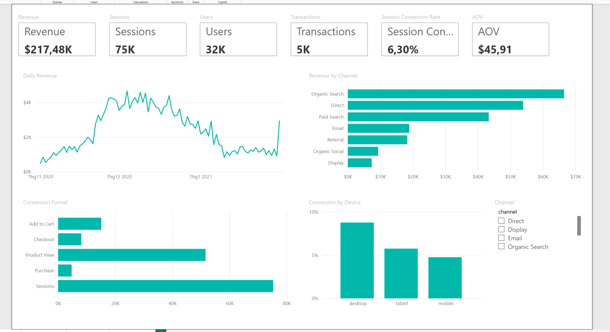
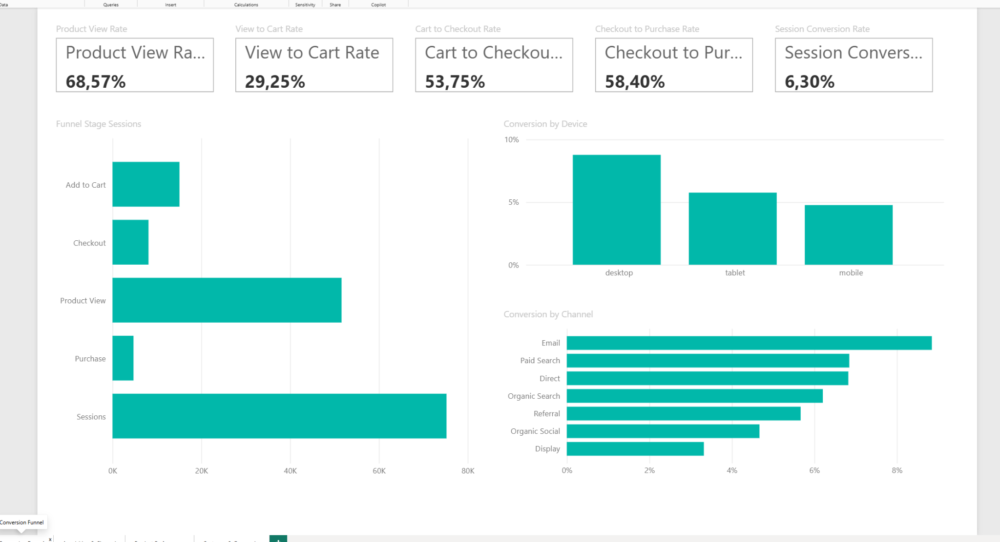
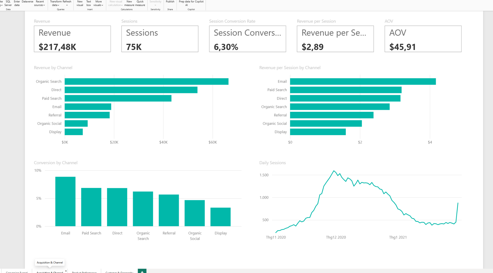
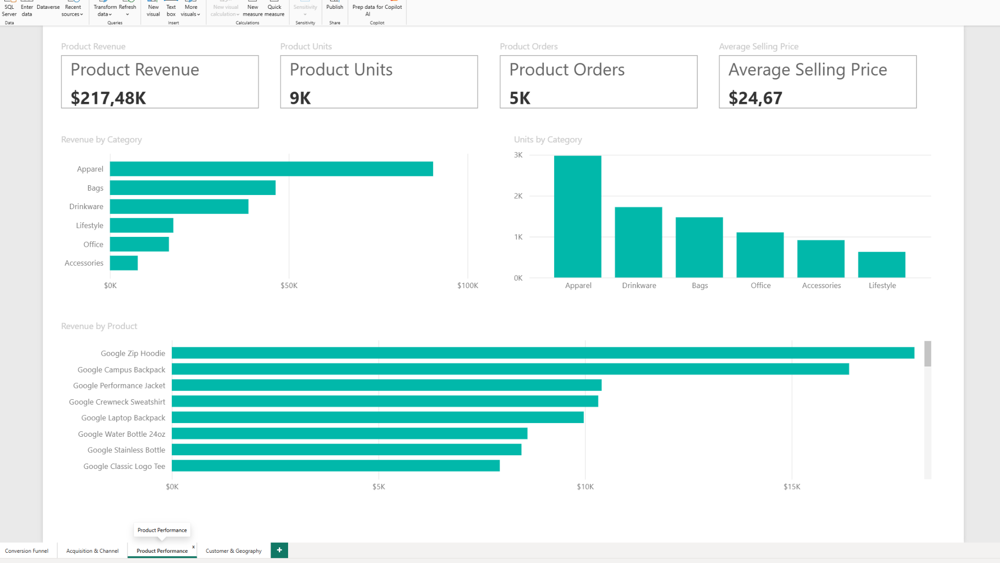
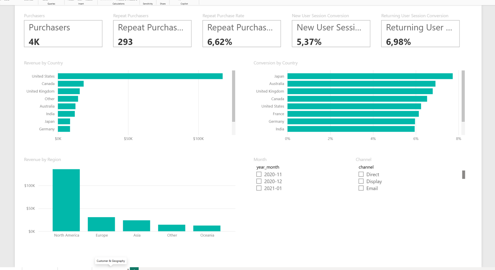
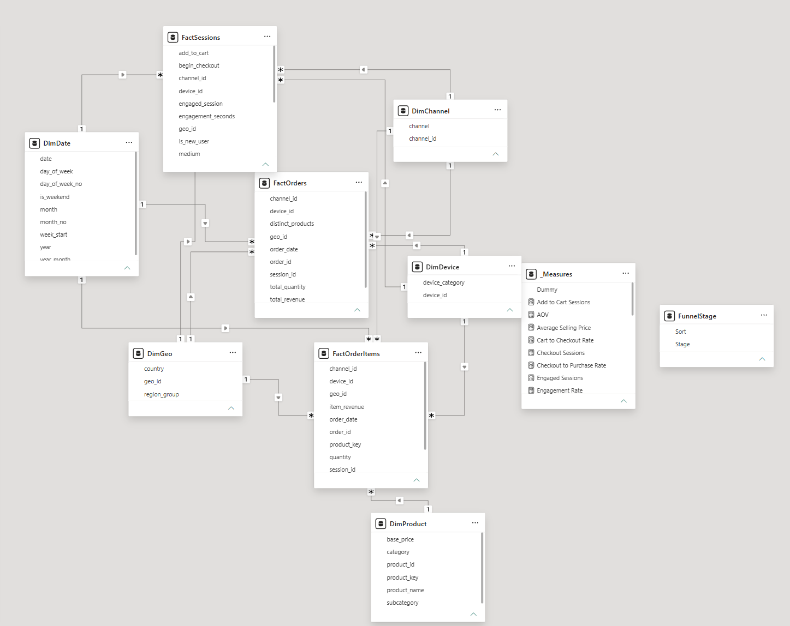

# E-commerce Growth & Conversion Analytics | Power BI

A finished portfolio project demonstrating **Power BI semantic modelling, Power Query, DAX, customer analytics, funnel analysis, acquisition analysis, and commercial decision-making**.



## Business objective

The project answers a practical e-commerce question:

> How can an e-commerce team connect traffic, conversion, customer behaviour, channel quality, and product performance to identify the most useful growth opportunities?

The report is structured around five analytical views:

1. Executive Overview
2. Conversion Funnel
3. Acquisition & Channel
4. Product Performance
5. Customer & Geography

## Power BI deliverable

The repository contains a complete **portable Power BI Project (PBIP)** under:

`powerbi/`

Main project file:

`powerbi/Ecommerce_Growth_Analytics.pbip`

The PBIP source contains:

- a TMDL semantic model
- 3 fact tables
- 5 shared dimensions
- 1 disconnected funnel-stage table
- a dedicated measures table
- 13 one-to-many relationships
- 30+ DAX measures
- 5 PBIR report pages
- cards, line charts, bar/column charts, and slicers


## Portable Power BI build

The eight analytical CSV tables are embedded directly inside the semantic model
as compressed payloads. The report therefore opens without relying on a local
folder path or a GitHub raw-data URL. The original CSV files are still included
under `data/` for transparency and reproducibility.

## Data

The bundled dataset is a deterministic GA4-style e-commerce demo dataset created for reproducible portfolio use.

| Metric | Value |
|---|---:|
| Sessions | 75,237 |
| Users | 32,000 |
| Transactions | 4,737 |
| Revenue | $217,478.50 |
| Session conversion rate | 6.30% |
| Average order value | $45.91 |

The repository also includes BigQuery SQL templates that map the same analytical structure to Google's public GA4 Merchandise Store sample dataset.

## Data model

The model uses a star-schema pattern with separate facts at different grains:

- **FactSessions** — one row per website session
- **FactOrders** — one row per order
- **FactOrderItems** — one row per product line

Dimensions:

- DimDate
- DimChannel
- DimDevice
- DimGeo
- DimProduct

This separation prevents session and order duplication when product-level analysis is introduced.

## Core DAX

Measures include:

- Sessions / Users / Engaged Sessions
- Product View / Add to Cart / Checkout / Purchase Sessions
- Product View Rate
- View-to-Cart Rate
- Cart-to-Checkout Rate
- Checkout-to-Purchase Rate
- Session Conversion Rate
- Revenue / Transactions / AOV
- Revenue per Session / Revenue per User
- Purchasers / Repeat Purchasers / Repeat Purchase Rate
- New vs Returning Session Conversion
- Product Revenue / Product Units / Product Orders / Average Selling Price
- Revenue Previous Month / Revenue MoM %

See [`docs/DAX_REFERENCE.md`](docs/DAX_REFERENCE.md).

## Key findings

### 1. Product consideration is the largest funnel loss

Only **29.25%** of product-view sessions progress to add-to-cart.

This makes product-detail-page quality, merchandising relevance, price perception, and CTA friction the first logical diagnostic area.

### 2. Mobile drives traffic but monetizes less efficiently

Mobile accounts for **57.8%** of sessions but converts at **4.76%**.

Desktop converts at **8.77%**.

The report therefore prioritizes mobile funnel diagnostics rather than simply increasing traffic.

### 3. Email is the most efficient channel in the observed dataset

Email conversion is **8.85%**, with **$4.17 revenue per session**.

Display converts at **3.32%**, with **$1.60 revenue per session**.

This does **not** imply that all budget should move to Email; lifecycle and paid-acquisition channels serve different roles.

### 4. Returning-user traffic is commercially stronger

Returning-user session conversion is **6.98%**, compared with **5.37%** for new-user sessions.

This supports lifecycle, remarketing, and repeat-purchase programs.

### 5. Product revenue is concentrated

The top-revenue SKU is **Google Zip Hoodie**, generating **$17,973.38** in the demo period.

## Power BI Desktop runtime verification

The project was opened successfully in Power BI Desktop and all five report pages
rendered with populated measures and visuals. The screenshots below are actual
Power BI Desktop output from this project, not mockups.

## Dashboard preview

### Conversion Funnel


### Acquisition & Channel


### Product Performance


### Customer & Geography



### Data Model


## Repository structure

```text
ecommerce_growth_conversion_power_bi/
├── README.md
├── DATA_NOTE.md
├── data/
├── docs/
│   ├── ANALYSIS_REPORT.md
│   ├── BUSINESS_BRIEF.md
│   ├── DATA_DICTIONARY.md
│   ├── DATA_MODEL.md
│   ├── DAX_REFERENCE.md
│   ├── HR_INTERVIEW_GUIDE.md
│   └── QA_CHECKS.md
├── outputs/
├── powerbi/
│   └── EcommerceGrowth_PBIP/
│       ├── E.pbip
│       ├── EcommerceGrowth.Report/
│       └── EcommerceGrowth.SemanticModel/
├── screenshots/
├── scripts/
└── sql/
```

## Portfolio positioning

This project demonstrates the full path from **business question → data model → measures → dashboard → decision** rather than treating Power BI as only a visualization tool.

## Data-source note

The bundled CSV values are synthetic portfolio data and are not presented as official Google production figures.

Google provides a public obfuscated GA4 e-commerce sample dataset for the Google Merchandise Store in BigQuery. The SQL templates in `sql/` document how the same semantic structure can be mapped to that source.
