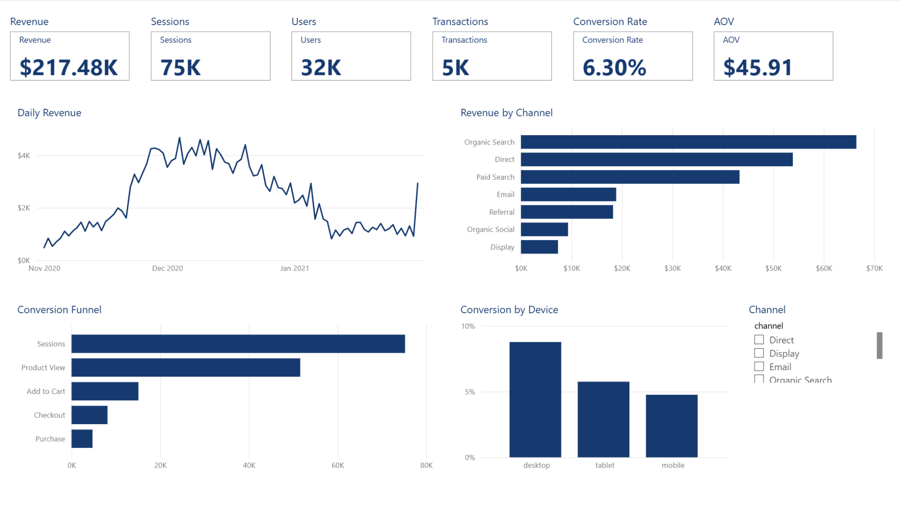
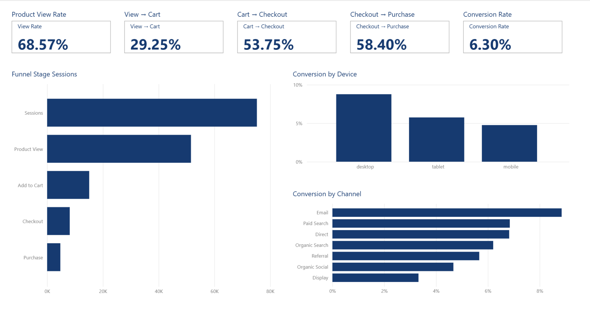
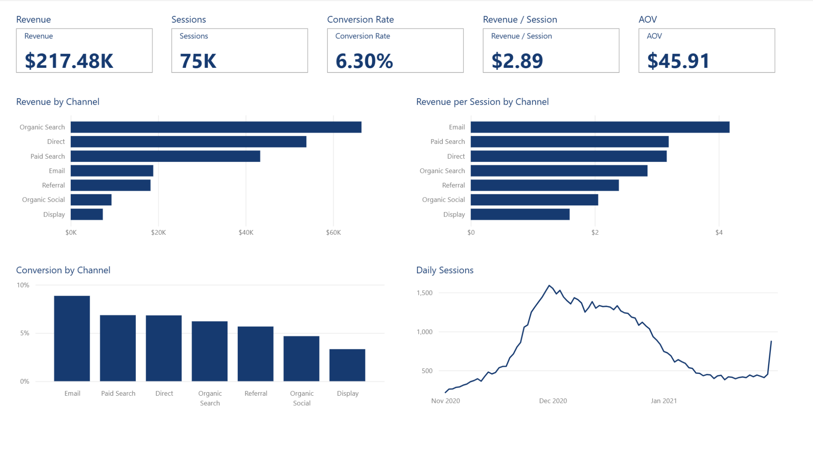
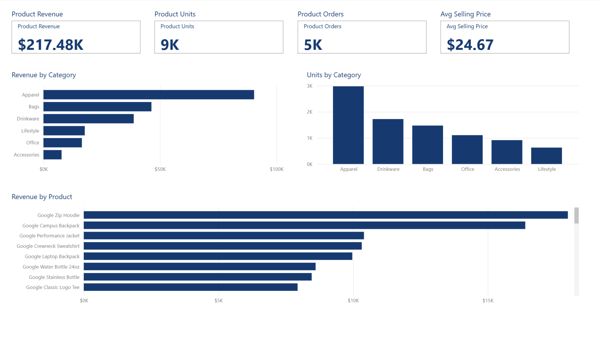
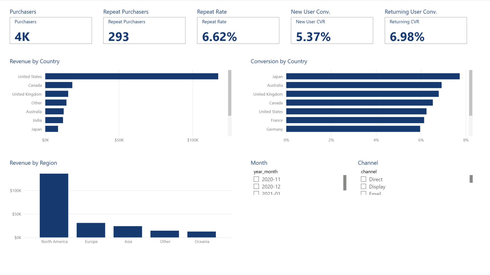
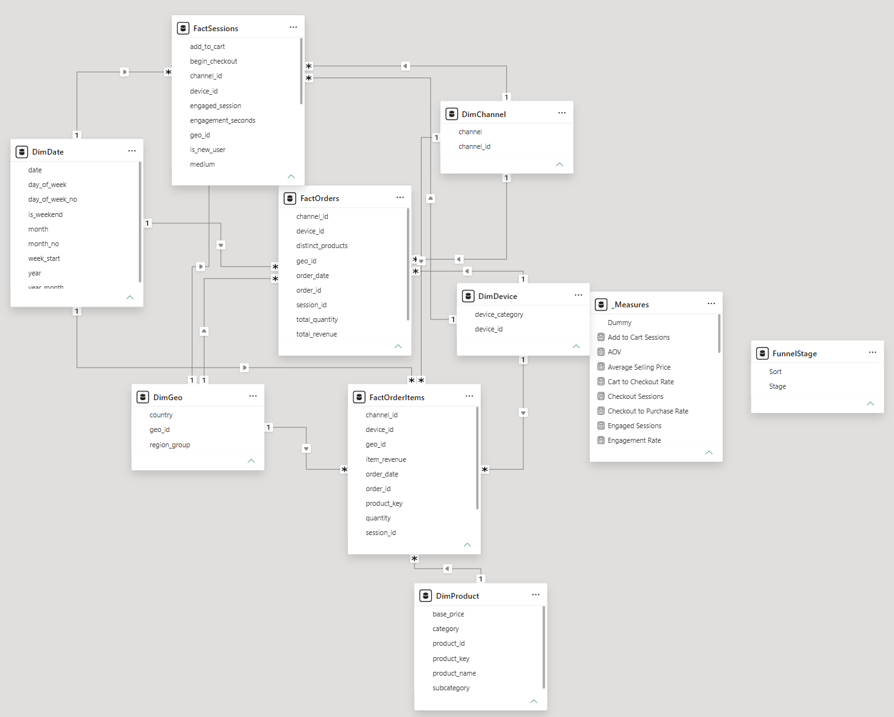

# E-commerce Growth & Conversion Analytics | Power BI

**Project type:** E-commerce / Growth Analytics  
**Tools:** Power BI, DAX, Power Query  
**Dataset:** Deterministic synthetic GA4-style e-commerce data  
**Runtime verification:** Power BI Desktop refresh and slicer interactions passed



---

## Business Question

How can an e-commerce team connect traffic, funnel conversion, acquisition quality, customer behaviour, geography, and product performance to identify the most useful growth opportunities?

The report is organised into five decision-focused pages:

1. Executive Overview
2. Conversion Funnel
3. Acquisition & Channel
4. Product Performance
5. Customer & Geography

---

## Headline KPIs

| KPI | Result |
|---|---:|
| Sessions | 75,237 |
| Users | 32,000 |
| Transactions | 4,737 |
| Revenue | $217,478.50 |
| Session Conversion Rate | 6.30% |
| Average Order Value | $45.91 |

These totals were rechecked after opening and refreshing the PBIP project in Power BI Desktop.

---

## Key Findings

### 1. Product view → add to cart is the largest funnel loss

The funnel contains:

| Stage | Sessions |
|---|---:|
| Sessions | 75,237 |
| Product View | 51,592 |
| Add to Cart | 15,090 |
| Checkout | 8,111 |
| Purchase | 4,737 |

Only **29.25%** of product-view sessions progress to add-to-cart.

This makes product-page relevance, merchandising, price perception, product information, and CTA friction sensible diagnostic areas before simply increasing traffic.

### 2. Mobile brings the most traffic but converts less efficiently

Mobile represents the largest traffic share but converts at approximately **4.76%**, compared with approximately **8.77%** on desktop.

The practical implication is to investigate mobile product-view and checkout friction before treating additional traffic as the primary growth lever.

### 3. Email is the strongest observed direct-response channel

Email converts at approximately **8.85%** and produces about **$4.17 revenue per session** in the bundled dataset.

Display converts at approximately **3.32%** and produces about **$1.60 revenue per session**.

This does not imply that all spend should be shifted to Email. Lifecycle and paid-acquisition channels serve different roles, and the bundled dataset does not contain complete media-cost or incrementality data.

### 4. Returning-user sessions convert better

Returning-user session conversion is approximately **6.98%**, compared with **5.37%** for new-user sessions.

This supports further lifecycle, remarketing, and repeat-purchase analysis.

### 5. Product revenue is concentrated

The highest-revenue SKU in the bundled dataset is **Google Zip Hoodie**, generating approximately **$17.97K** during the demo period.

---

## Semantic Model

The model uses separate fact tables at different grains:

- **FactSessions** — one row per website session
- **FactOrders** — one row per order
- **FactOrderItems** — one row per product line

Shared dimensions:

- `DimDate`
- `DimChannel`
- `DimDevice`
- `DimGeo`
- `DimProduct`

Supporting model objects:

- `_Measures` — dedicated DAX measure table
- `FunnelStage` — disconnected helper table for funnel ordering

The model contains **13 one-to-many relationships** and **31 DAX measures**.

This grain separation prevents session and order metrics from being duplicated when product-level analysis is introduced.

See:
- [`docs/DATA_MODEL.md`](docs/DATA_MODEL.md)
- [`docs/DAX_REFERENCE.md`](docs/DAX_REFERENCE.md)
- [`docs/DATA_DICTIONARY.md`](docs/DATA_DICTIONARY.md)

---

## Report Pages

### Executive Overview

Traffic, revenue, conversion, channel, funnel and device performance in one management view.


### Conversion Funnel

Step conversion rates plus device and channel conversion comparison.



### Acquisition & Channel

Revenue, conversion rate, revenue per session and traffic trends by acquisition channel.



### Product Performance

Revenue, units, orders, selling price, category mix and SKU performance.



### Customer & Geography

Purchasers, repeat purchase, new-vs-returning conversion, country and region performance.



### Data Model



---

## Core DAX Coverage

Measures include:

- Sessions
- Users
- Engaged Sessions
- Product View Sessions
- Add to Cart Sessions
- Checkout Sessions
- Purchase Sessions
- Product View Rate
- View-to-Cart Rate
- Cart-to-Checkout Rate
- Checkout-to-Purchase Rate
- Session Conversion Rate
- Revenue
- Transactions
- AOV
- Revenue per Session
- Revenue per User
- Purchasers
- Repeat Purchasers
- Repeat Purchase Rate
- New User Session Conversion
- Returning User Session Conversion
- Product Revenue
- Product Units
- Product Orders
- Average Selling Price
- Revenue Previous Month
- Revenue MoM %

Full definitions are documented in [`docs/DAX_REFERENCE.md`](docs/DAX_REFERENCE.md).

---

## Portable PBIP Build

Main project file:

```text
powerbi/Ecommerce_Growth_Conversion_Analytics.pbip
```

The semantic model stores the eight bundled analytical tables inside the PBIP model definition, so the report does not depend on a machine-specific CSV path when opened.

The original CSV tables remain under `data/` for transparency and validation.

Local Power BI workspace/cache folders (`.pbi/`) are intentionally excluded from version control because they are regenerated by Power BI Desktop and are not required to reproduce the project.

---

## How to Reproduce

1. Install Power BI Desktop.
2. Clone or download this repository.
3. Open:
   ```text
   powerbi/Ecommerce_Growth_Conversion_Analytics.pbip
   ```
4. Allow the project to load.
5. Select **Refresh**.
6. Confirm the headline totals against [`docs/QA_CHECKS.md`](docs/QA_CHECKS.md).
7. Test a Channel or Month slicer to confirm filter interactions.

The final runtime test verified that the project opens, refreshes, renders all five pages, and responds to slicer interactions.

---

## Data

The bundled data are **synthetic deterministic portfolio data** designed to resemble a GA4-style e-commerce analytical schema. They are not presented as official Google production figures.

The repository also contains BigQuery SQL templates showing how a similar semantic structure could be created from Google's public GA4 Merchandise Store sample dataset.

See:
- [`DATA_NOTE.md`](DATA_NOTE.md)
- [`../DATA_SOURCES.md`](../DATA_SOURCES.md)
- [`sql/README.md`](sql/README.md)

---

## Project Structure

```text
ecommerce_growth_conversion_power_bi/
├── README.md
├── DATA_NOTE.md
├── data/
├── docs/
│   ├── ANALYSIS_REPORT.md
│   ├── BUSINESS_BRIEF.md
│   ├── DATA_DICTIONARY.md
│   ├── DATA_MODEL.md
│   ├── DAX_REFERENCE.md
│   └── QA_CHECKS.md
├── outputs/
├── powerbi/
│   ├── Ecommerce_Growth_Conversion_Analytics.pbip
│   ├── EcommerceGrowth.Model/
│   ├── EcommerceGrowth.Report/
│   └── ARTIFACT_NOTE.md
├── screenshots/
│   ├── 01_01_overview_dashboard.png
│   ├── 02_01_funnel_conversion_dashboard.png
│   ├── 03_01_acquisition_channel_dashboard.png
│   ├── 04_01_product_performance_dashboard.png
│   ├── 05_01_customer_geography_dashboard.png
│   └── 06_01_data_model.png
├── scripts/
└── sql/
```

---

## Limitations

- The bundled dataset is synthetic, so findings demonstrate analytical workflow rather than real Google or employer performance.
- Media spend is not available, so CAC and ROAS are intentionally not calculated.
- Margin and fulfilment cost are not available, so revenue should not be interpreted as profit.
- The report is descriptive and diagnostic; it does not establish causal impact or incrementality.
