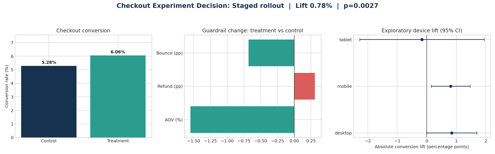

# Checkout A/B Test — Experimentation Module

This module closes the causal-decision gap in the descriptive Power BI funnel analysis. It asks whether a simplified checkout should be rolled out, rather than merely identifying where users leave the funnel.

## Pre-analysis decision rules

| Gate | Rule |
|---|---|
| SRM | Chi-square p-value above 0.05 |
| Pre-treatment balance | Categorical share gaps below 2 pp and numeric absolute SMD below 0.10 |
| Primary outcome | Treatment-control purchase-conversion lift with 95% CI and two-sided p-value |
| Power | Report the approximate 80% power MDE |
| AOV guardrail | Treatment no more than 5% below control |
| Refund guardrail | Increase below 1 percentage point |
| Bounce guardrail | No increase |

The randomisation unit is the **user**, preventing one person from appearing in both variants. The primary metric is user-level conversion. Device and channel results are explicitly exploratory because the test is powered for the overall effect.



## Reproduce

From the repository root:

```bash
python ecommerce_growth_conversion_power_bi/experiment/run_experiment.py
```

Expected result:

```text
PASS — experiment analysis completed
SRM p-value: 1.000
Decision: Staged rollout
```

## Start here

- [Decision memo](memo/experiment_memo.md)
- [Analysis code](run_experiment.py)
- [Experiment summary](outputs/experiment_summary.csv)
- [Balance checks](outputs/balance_checks.csv)
- [Guardrail results](outputs/guardrail_results.csv)
- [Exploratory segment results](outputs/exploratory_segment_results.csv)

## Data disclosure

Pre-experiment covariates come from this project's deterministic synthetic GA4-style population. Variant assignment and outcomes are generated with seed `2026` and are also synthetic. This case demonstrates experiment reasoning and reproducibility; it is not presented as real company evidence.
