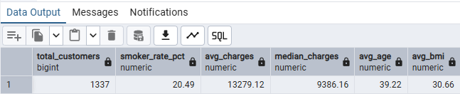
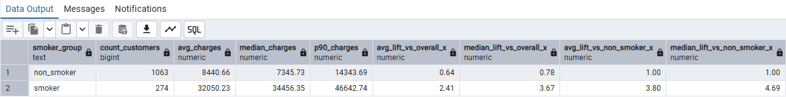
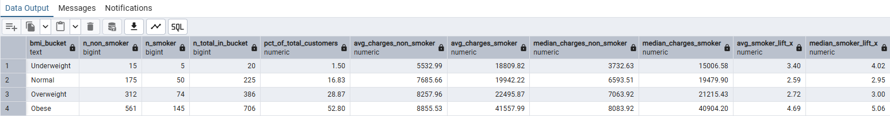
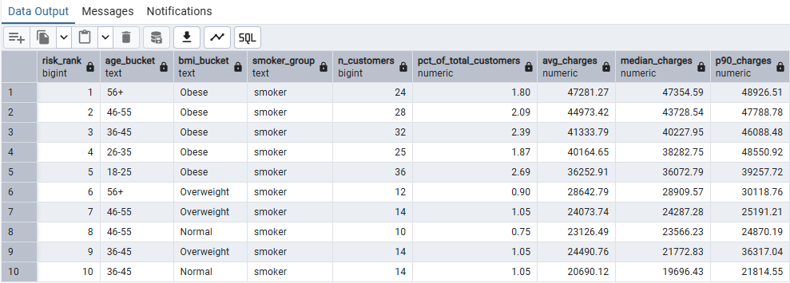

# Insurance Charges Drivers & High-Cost Risk Segmentation

**Project type:** SQL Analytics Case Study  
**Focus:** Identifying charge drivers and high-cost customer segments  
**Tools:** PostgreSQL 18, SQL — runtime-tested with pgAdmin 4  
**Grain:** 1 row = 1 customer record

---

## Business Question

Which customer characteristics are most strongly associated with higher insurance charges, and which customer segments represent the highest observed cost risk?

The analysis focuses on smoking status, age and BMI, then combines those dimensions to identify segments with unusually high median and upper-tail charges.

---

## Dataset

**Source:** Kaggle — *Insurance Dataset* by `mirichoi0218`  
**Source page:** https://www.kaggle.com/datasets/mirichoi0218/insurance  
**Local file:** `data/insurance.csv`

Core fields:

- `age`
- `sex`
- `bmi`
- `children`
- `smoker`
- `region`
- `charges`

The source file contains **1,338 rows**. The final analytical layer contains **1,337 rows** after removing one exact duplicate.

For repository-wide provenance and licensing notes, see [`../DATA_SOURCES.md`](../DATA_SOURCES.md).

---

## Analytical Workflow

The project separates database setup from analysis so that the workflow can be reproduced cleanly.

```text
data/insurance.csv
        ↓
setup_schema.sql
        ↓
raw.insurance
        ↓
insurance_charges_analysis.sql
        ↓
analytics.v_insurance_clean
        ↓
analytics.v_insurance_final
        ↓
driver, interaction and risk-segmentation outputs
```

### Runtime-verified row counts

| Layer | Rows |
|---|---:|
| `raw.insurance` | 1,338 |
| `analytics.v_insurance_clean` | 1,338 |
| `analytics.v_insurance_final` | 1,337 |

---

## Analysis Structure

### 1. Schema and data sanity

The analysis first confirms:

- active database/session context
- existence of `raw.insurance`
- expected column types
- raw row count

This prevents later results from being interpreted before the source table has been loaded correctly.

### 2. Cleaning and data-quality checks

The SQL workflow checks:

- missing values
- age, BMI and charge ranges
- category consistency
- exact duplicates

Derived analytical fields include:

- `is_smoker`
- `age_bucket`
- `bmi_bucket`

One exact duplicate is removed in the final analytical view.

### 3. Baseline charge profile

Population-level KPIs establish the baseline before segment comparisons, including customer count, smoker rate, average charges, median charges, average age, and average BMI.



### 4. Smoking status as a charge driver

Smokers and non-smokers are compared using:

- customer count
- average charges
- median charges
- 90th-percentile charges
- lift versus the overall population
- lift versus non-smokers



### 5. BMI × smoking interaction

The analysis tests whether the relationship between BMI and charges differs by smoking status.

Outputs include:

- BMI bucket
- smoker and non-smoker counts
- share of total customers
- average charges for each smoking group
- median charges for each smoking group
- smoker lift in average and median charges



### 6. High-cost risk segmentation

Customer segments are formed from:

- age bucket
- BMI bucket
- smoker group

Segments are ranked using median charges, with average and 90th-percentile charges retained for context.



---

## Key Findings

The analysis indicates that:

- **Smoking status is the strongest observed charge separator** in this dataset.
- Higher BMI is associated with substantially higher charges particularly within smoker segments.
- The highest-cost ranked segments are concentrated among smokers, with obese and older smoker groups appearing prominently.
- Median and 90th-percentile charges provide a more useful view of segment risk than the mean alone because the charge distribution is right-skewed.

These findings describe **associations in this dataset**. They should not be interpreted as causal effects.

---

## SQL Techniques Demonstrated

- schemas and views
- CTEs (`WITH`)
- conditional bucketing with `CASE`
- aggregations (`COUNT`, `AVG`)
- `percentile_cont()` for median and p90
- window functions including `DENSE_RANK`
- duplicate detection
- conditional aggregation
- safe division using `NULLIF`
- segment-level lift calculations

---

## How to Reproduce

The project requires PostgreSQL. It was runtime-tested with **PostgreSQL 18 and pgAdmin 4**, but the SQL can be run from another PostgreSQL client.

### Step 1 — Create a database

Create a PostgreSQL database for the project. The runtime test used:

```text
insurance_portfolio
```

### Step 2 — Run the schema setup

Open and execute:

```text
setup_schema.sql
```

This creates the required `raw` schema and `raw.insurance` table.

### Step 3 — Import the CSV

Import:

```text
data/insurance.csv
```

into:

```text
raw.insurance
```

CSV import settings:

```text
Format: CSV
Header: Yes
Delimiter: ,
Encoding: UTF8
```

Verify the import:

```sql
SELECT COUNT(*)
FROM raw.insurance;
```

Expected result:

```text
1338
```

### Step 4 — Run the analysis

Open:

```text
insurance_charges_analysis.sql
```

and execute the script from top to bottom.

### Step 5 — Verify the analytical layers

```sql
SELECT 'raw' AS stage, COUNT(*) AS row_count
FROM raw.insurance

UNION ALL

SELECT 'clean', COUNT(*)
FROM analytics.v_insurance_clean

UNION ALL

SELECT 'final', COUNT(*)
FROM analytics.v_insurance_final;
```

Expected result:

```text
raw     1338
clean   1338
final   1337
```

The final sections of the analysis script return populated driver and risk-segmentation tables.

---

## Limitations

- The dataset is observational; the analysis identifies association, not causation.
- Medical history, claims detail and chronic-condition variables are not available.
- Age and BMI bucket thresholds are analyst-defined.
- The dataset is relatively small, so narrow segments should be interpreted with sample size in mind.
- The analysis is designed as a portfolio case study rather than an actuarial pricing model.

---

## Project Files

```text
insurance_risk_segmentation_sql/
├── data/
│   └── insurance.csv
├── insurance_sql_screenshots/
│   ├── 03_01_baseline_kpis.png
│   ├── 04_01_smoker_vs_charges_summary.png
│   ├── 05_01_bmi_bucket_x_smoker_summary.png
│   └── 06_01_top_risk_segments.png
├── setup_schema.sql
├── insurance_charges_analysis.sql
└── README.md
```
