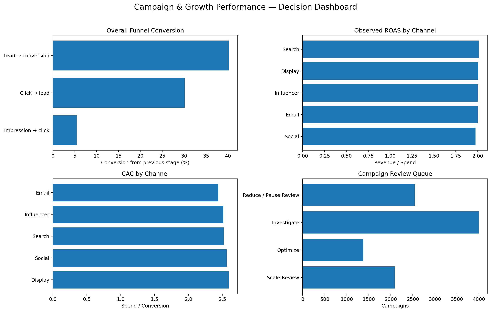

# Campaign & Growth Performance

**Flagship 2 of 3 · Customer & Growth Analytics**  
**Tools:** Python, pandas, NumPy, matplotlib  
**Data:** 10,000 campaign-level records from the Marketing Campaign Performance Dataset used by the canonical notebook

## Business decision

Where does marketing performance weaken across the funnel, which campaigns deserve scale or optimisation review, and what can the available data support without overclaiming causality?



## Decision summary

Across the complete 10,000-campaign dataset:

- **CTR:** 5.48%
- **Click → Lead:** 30.13%
- **Lead → Conversion:** 40.23%
- **Observed CAC:** $2.53
- **Observed ROAS:** 2.00x

The largest funnel loss is the impression-to-click stage. Channel averages are relatively close, so campaign-level variation provides a more useful basis for prioritisation than channel ranking alone.

- **Search** has the highest weighted observed ROAS at approximately **2.01x**.
- **Email** has the lowest weighted CAC at approximately **$2.44**.
- Campaigns with stronger click response but weaker post-click conversion enter an **Optimize** queue.
- High-ROAS, low-CAC campaigns with solid conversion volume enter **Scale Review**.
- Weak-ROAS, high-CAC campaigns enter **Reduce / Pause Review**.

These labels support human review; they are not automatic spend instructions.

## Metric logic

| Metric | Formula | Decision use |
|---|---|---|
| CTR | Clicks ÷ Impressions | Creative/audience response |
| Click-to-lead | Leads ÷ Clicks | Landing-page/form effectiveness |
| Lead-to-conversion | Conversions ÷ Leads | Lead quality and offer/sales effectiveness |
| Conversion rate | Conversions ÷ Clicks | Post-click conversion efficiency |
| CAC | Spend ÷ Conversions | Acquisition efficiency |
| ROAS | Revenue ÷ Spend | Observed return, not causal incrementality |

Channel rates are calculated from **summed numerators and denominators**, not by averaging campaign-level rates.

## Canonical source of truth

The canonical analytical pair for this project is:

```text
data/marketing_campaign_performance_10000.csv
marketing_campaign_funnel_analysis.ipynb
```

The notebook and CSV produce the headline funnel metrics above. `analysis/run_analysis.py` provides a script-based reproduction of the same source data and refreshes the decision outputs, dashboard, and memo.

## Reproduce

From the repository root:

```bash
python marketing_campaign_funnel_analysis/analysis/run_analysis.py
```

Expected headline output:

```text
PASS — campaign analysis completed
Campaigns: 10,000
CTR: 5.48%
Click → Lead: 30.13%
Lead → Conversion: 40.23%
CAC: $2.53
ROAS: 2.00x
```

The analysis validates schema, dates, funnel ordering, missingness, duplicate campaign IDs, negative measures, and KPI finiteness before producing outputs.

## Start here

- [Canonical notebook](marketing_campaign_funnel_analysis.ipynb)
- [Decision memo](memo/business_memo.md)
- [Decision dashboard](figures/campaign_decision_dashboard.png)
- [Script reproduction](analysis/run_analysis.py)
- [Channel performance](outputs/channel_performance.csv)
- [Campaign decision table](outputs/campaign_decision_table.csv)

## Data source

The canonical notebook identifies the source as the **Marketing Campaign Performance Dataset** on Kaggle, published by **Mirza Yasir Abdullah Baig**:

https://www.kaggle.com/datasets/mirzayasirabdullah07/marketing-campaign-performance-dataset/data

The dataset is used here as a portfolio analysis dataset and is not presented as data from a specific employer, client, or advertising account. See the repository-level `DATA_SOURCES.md` for provenance notes.

## Limitations

The data are campaign-level and do not include user-level behaviour, creative type, landing page, audience segment, device, campaign objective, contribution margin, or an experimental holdout. Results are descriptive and should not be interpreted as proof of causal incrementality.
